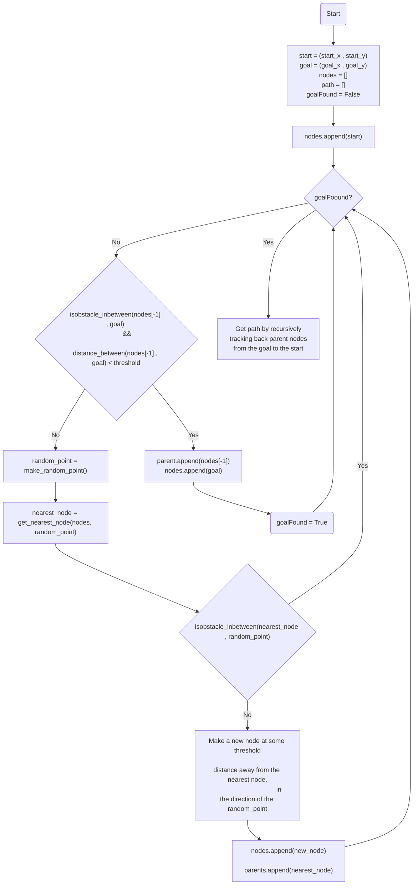

# RRT 

The Rapidly-exploring Random Tree (RRT) algorithm is a path planning and motion planning technique primarily used in robotics. It operates by iteratively building a tree structure in the configuration space of a robot or an agent, gradually exploring the search space towards a predefined goal.

RRT is particularly effective in high-dimensional and complex configuration spaces and is known for its probabilistic completeness, meaning it will find a solution if one exists given enough iterations.

Its flexibility and ability to handle dynamic environments make it a popular choice in robotics for tasks such as motion planning, navigation, and obstacle avoidance.

## The Algorithm

## Demo

Insert gif or link to demo

## Lessons Learned

1. **Thorough Testing of Small Functions**:
Checking and rechecking the smaller tools, like creating random points, turned out to be critical. A key realization hit when weird issues cropped up due to how OpenCV indexes pixels. When drawing shapes like circles (`cv2.circle`), it takes coordinates as 'x, y', but when looking at specific pixels in the image, it reverses this order to 'y, x'. This reversal caused tricky bugs during implementation.

2. **Separating Math and Pictures**:
Utilizing a pristine copy of the input map for computations while employing a separate image for visual representation (e.g., with cv2.circle or cv2.line) was crucial. Failure to segregate these datasets resulted in visual elements being interpreted as obstacles during computation, impacting algorithm performance.

These takeaways stress the importance of double-checking the small stuff, knowing how libraries handle things, and keeping your data tidy for better code performance.

## Notes

This work was done as a coursework part of the CSE 568 course at University at Buffalo. The source code is not available publicly to avoid academic integrity violations. Please feel free to contact the author if you wish access to the source code.

