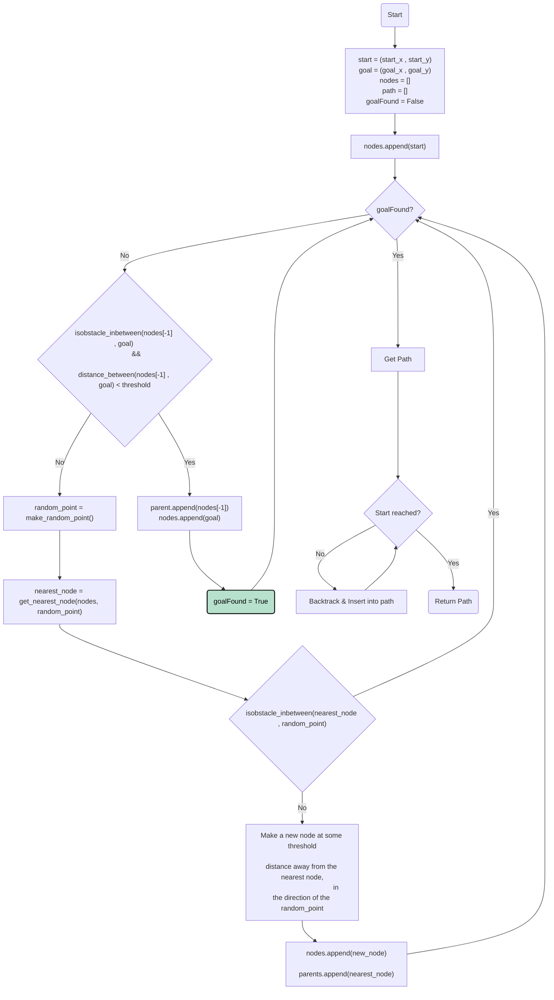

# RRT 

## Introduction

The Rapidly-exploring Random Tree (RRT) algorithm is a path planning and motion planning technique primarily used in robotics. It operates by iteratively building a tree structure in the configuration space of a robot or an agent, gradually exploring the search space towards a predefined goal.

RRT is particularly effective in high-dimensional and complex configuration spaces and is known for its probabilistic completeness, meaning it will find a solution if one exists given enough iterations.

Its flexibility and ability to handle dynamic environments make it a popular choice in robotics for tasks such as motion planning, navigation, and obstacle avoidance.


## The Algorithm

1. **Initialization** (`Init`):
   - Initialize start, goal, empty nodes, and path lists, and set `goalFound` as false. These hold the starting and target positions, a list to track explored nodes, and a boolean to track goal attainment.

2. **Building Initial Nodes** (`C`):
   - Add the start position to the `nodes` list.

3. **Exploration Loop** (`loop_start`):
   - Loop until the goal is found.
  
4. **Goal Check** (`First_check`):
   - Check if the goal is directly reachable from the last node and within a defined distance threshold. If not, proceed to exploration.

5. **Random Point Generation** (`random_point`):
   - Generate a random point within the map boundaries.

6. **Nearest Node Determination** (`nearest_node`):
   - Find the nearest node in the `nodes` list to the generated random point.

7. **Obstacle Check** (`Second_check`):
   - Verify if there are obstacles between the nearest node and the random point. If not, proceed to adding a new node.

8. **New Node Addition** (`add_node`):
   - Create a new node at a certain distance from the nearest node towards the random point and add it to the `nodes` list.

9. **Update Node Relationships** (`update`):
   - Update the parent-child relationship between the new node and the nearest node.

10. **Goal Update** (`update2`):
    - If the goal conditions are met, set `goalFound` as true and finalize the loop.

11. **Path Retrieval** (`path`):
    - Once the goal is found, retrieve the path by backtracking through the nodes from the goal to the start.

This flowchart illustrates the process of iteratively expanding nodes, searching for a feasible path from the start to the goal while avoiding obstacles in the map. It maintains a loop until the goal is found or deemed unreachable within the specified constraints.





## Demo

Here's a demonstration of the algorithm using the provided code:

```python
map_path = 'maps/map2.png'
map = cv2.imread(map_path)

rrt = rrt_navigator()

startX = 200
startY = 25
goalX = 500
goalY = 600

path = rrt.get_path(map, startX, startY, goalX, goalY)
```

https://github.com/imalhotra15/RRT/assets/118845522/04f756e1-ae2a-4f3b-872a-0e1595053864

The algorithm generated the following path:

[(200, 25), (202, 59), (203, 90), (172, 98), (161, 127), (161, 157), (190, 166), (196, 195), (191, 227), (183, 256), (152, 260), (142, 289), (140, 322), (151, 349), (140, 379), (152, 406), (139, 435), (153, 461), (182, 473), (182, 503), (212, 507), (242, 502), (269, 515), (293, 532), (319, 546), (348, 552), (353, 522), (350, 491), (360, 462), (365, 432), (389, 414), (403, 387), (418, 360), (399, 357), (388, 345), (402, 318), (410, 288), (401, 257), (431, 256), (460, 257), (491, 252), (500, 600)] 

## Lessons Learned

1. **Thorough Testing of Small Functions**:
Checking and rechecking the smaller tools, like creating random points, turned out to be critical. A key realization hit when weird issues cropped up due to how OpenCV indexes pixels. When drawing shapes like circles (`cv2.circle`), it takes coordinates as 'x, y', but when looking at specific pixels in the image, it reverses this order to 'y, x'. This reversal caused tricky bugs during implementation.

2. **Separating Math and Pictures**:
Utilizing a pristine copy of the input map for computations while employing a separate image for visual representation (e.g., with cv2.circle or cv2.line) was crucial. Failure to segregate these datasets resulted in visual elements being interpreted as obstacles during computation, impacting algorithm performance.

These takeaways stress the importance of double-checking the small stuff, knowing how libraries handle things, and keeping your data tidy for better code performance.


## Notes

This was done as a part of the coursework of CSE 568 at the University at Buffalo. The source code is not available publicly to avoid academic integrity violations. Please feel free to contact the author if you wish access to the source code.

